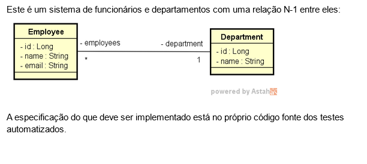
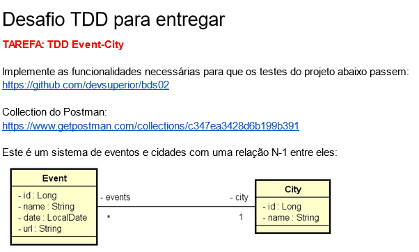
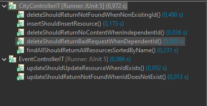

# **Desafio TDD - DevSuperior**

O desavio tem como objetivo criar as funcionalidades necessárias para completar o código a partir dos testes de integrações apresentados.

---

## **Desafio Empregados TDD**

### Desafio:

Implementar as funcionalidades de necessárias nas classes de Employee e Department, considerando os testes de integração apresentados:



---

## **Exemplo de teste**

```java
@Test
	public void insertShouldInsertResource() throws Exception {

		EmployeeDTO dto = new EmployeeDTO(null, "Joaquim", "joaquim@gmail.com", 1L);
		String jsonBody = objectMapper.writeValueAsString(dto);

		ResultActions result =
				mockMvc.perform(post("/employees")
					.content(jsonBody)
					.contentType(MediaType.APPLICATION_JSON)
					.accept(MediaType.APPLICATION_JSON));

		result.andExpect(status().isCreated());
		result.andExpect(jsonPath("$.id").exists());
		result.andExpect(jsonPath("$.name").value("Joaquim"));
		result.andExpect(jsonPath("$.email").value("joaquim@gmail.com"));
		result.andExpect(jsonPath("$.departmentId").value(1L));
	}


```

---

## **Desafio TDD Event-City**

Implementar as funcionalidades de necessárias nas classes de City e Event, considerando os testes de integração apresentados:



---

## **Exemplo de teste**

```java
@Test
	public void deleteShouldReturnNoContentWhenIndependentId() throws Exception {

		Long independentId = 5L;

		ResultActions result =
				mockMvc.perform(delete("/cities/{id}", independentId));


		result.andExpect(status().isNoContent());
	}
```

```java
    @Test
	public void updateShouldUpdateResourceWhenIdExists() throws Exception {

		long existingId = 1L;

		EventDTO dto = new EventDTO(null, "Expo XP", LocalDate.of(2021, 5, 18), "https://expoxp.com.br", 7L);
		String jsonBody = objectMapper.writeValueAsString(dto);

		ResultActions result =
				mockMvc.perform(put("/events/{id}", existingId)
					.content(jsonBody)
					.contentType(MediaType.APPLICATION_JSON)
					.accept(MediaType.APPLICATION_JSON));

		result.andExpect(status().isOk());
		result.andExpect(jsonPath("$.id").exists());
		result.andExpect(jsonPath("$.id").value(1L));
		result.andExpect(jsonPath("$.name").value("Expo XP"));
		result.andExpect(jsonPath("$.date").value("2021-05-18"));
		result.andExpect(jsonPath("$.url").value("https://expoxp.com.br"));
		result.andExpect(jsonPath("$.cityId").value(7L));
	}
```

### Testes


